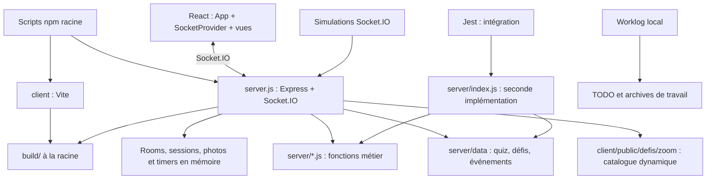

# Revue du POC LCG avant la V1

Date : 17 septembre 2026. Statut : audit terminé, ordre du plan validé le 17 septembre 2026 ; corrections non commencées.
Référence : branche `main`, commit `7bcad37`, avec les changements locaux déjà présents au démarrage.

## Conclusion

Le POC possède un socle réutilisable : séparation client/serveur, composants graphiques communs, plusieurs fonctions métier extraites et testées, simulations multijoueurs, mécanismes de reconnexion et synchronisation de l’horloge. La compilation du jeu fonctionne et le lint du client est propre.

Le principal risque avant la V1 est un moteur de jeu réparti entre deux implémentations serveur, avec des contrôles Socket.IO incomplets. Des erreurs de rôle, de répétition et de validation peuvent modifier les scores, reprendre l’identité d’un autre joueur ou arrêter le processus. Les corriger et tester le serveur réellement lancé doit précéder le grand découpage des fichiers.

Aucune modification applicative, suppression, installation de dépendance ou commit n’a été effectué pendant cet audit. Les seuls ajouts durables sont le rapport et les journaux. Les scripts de mesure, reproductions et builds d’audit sont dans `tmp/poc-audit/`, ignoré par Git.

## 1. Périmètre et méthode

- Inventaire du dépôt courant et des documents non suivis. Rapport recentré le 18 septembre à la demande de Lucas : Question Studio / LCG Studio est entièrement hors périmètre ; ses observations et actions de nettoyage sont retirées. Aucune de ses versions n’est à consulter, modifier, tester ou rapatrier.
- Analyse syntaxique et graphe des imports des sources JavaScript/JSX, recherches de références, métriques, empreintes SHA-256 des assets et contrôle structurel des questions.
- Lecture des configurations, points d’entrée, modules métier, principales vues, gestionnaires Socket.IO, scripts et tests. Revue approfondie des chemins sensibles : sessions, transitions, scores, timers et photos.
- Exécution du lint, des builds isolés, des tests existants et de reproductions ciblées sur des serveurs locaux contenant exclusivement des parties fictives.
- Pas de validation visuelle exhaustive sur téléphone, pas de test de charge, pas d’accès à Render/Netlify/Supabase, pas d’audit de vulnérabilités du registre npm. L’audit structurel couvre l’ensemble ; il ne constitue pas une preuve d’absence de défaut sur chaque chemin UI.

État préexistant préservé : `package.json` et `server/tests/content_selection.test.js` modifiés ; `question-studio/`, les deux journaux, `docs/books/` et plusieurs documents non suivis. Ces éléments ne doivent pas être incorporés indistinctement dans un futur commit de nettoyage.

## 2. Cartographie actuelle



| Zone | Responsabilité actuelle | Observation |
|---|---|---|
| Racine | Orchestration npm, serveur principal, distribution du client | `npm start` et `npm run server:dev` lancent `server.js` |
| `client/src/` | 80 fichiers JS/JSX/CSS, environ 12 560 lignes | Navigation par `room.status`, sans routeur d’URL ; cohérent pour ce jeu |
| `server.js` | Moteur principal, HTTP, sockets, état, règles, médias | Environ 2 992 lignes, 49 événements entrants |
| `server/index.js` | Autre serveur autonome, encore utilisé par Jest et son script `dev` | Environ 2 232 lignes, 44 événements entrants |
| `server/*.js` | Plateau, sélection de contenu, activité, règles de pause/annulation, Pick et récompenses | Bon début de séparation, à conserver |
| `server/data/` | Données exécutées par le jeu | 342 quiz structurés, 342 clés de contenu distinctes |
| `client/public/` et assets source | Images, SVG, fontes, références graphiques | 364 fichiers examinés, environ 53,35 Mo ; ce n’est pas le poids téléchargé à l’ouverture |
| `build/` | Résultat Vite servi par Express | 365 fichiers déjà suivis par Git |
| `scripts/agent-swarm/` | Clients Socket.IO simulés, sans navigateur | 11 scénarios de démarrage et un runner de 7 collisions de bonus |
| `docs/worklog-site/` | Outil local de suivi historique et validations | À distinguer du nouveau journal technique et du backlog externe |

Le fichier généré `worklog-data.js` (~9 823 lignes) n’est pas un monolithe applicatif à découper artificiellement. Son problème éventuel est la provenance et la régénération.

## 3. Problèmes prioritaires confirmés

### A1 — Jetons de session exposés aux autres joueurs — priorité haute

Sources : `server.js:721`, `server.js:945`, `server.js:1102` ; `SocketContext.jsx:45` pour la persistance du snapshot.

`createTrackedPlayer` stocke le jeton dans le joueur, puis `createRoomStatePayload` diffuse pratiquement toute la room. Chaque participant reçoit donc les jetons des autres joueurs et les données internes telles que les invitations. La reconnexion recherche ensuite un joueur par ce jeton et transfère sa place à la nouvelle socket.

**Reproduit localement :** un deuxième client reçoit le jeton fictif de l’hôte ; une nouvelle connexion utilisant ce jeton récupère la place et le rôle administrateur de l’hôte.

Prévoir un objet public de room construit explicitement, sans secrets, avec des données adaptées aux rôles lorsque nécessaire. Ne pas casser le contrat UI en supprimant arbitrairement des champs sans tests.

### A2 — Résolutions répétables et commandes hors rôle/hors phase — priorité haute

Sources : `server.js:1706`, `1775`, `1803`, `1807`, `2317`, `2743`, `2848`.

Les contrôles sont solides dans certains bonus mais absents dans plusieurs commandes générales. `resolve_interaction` fait confiance au verdict du client, ne vérifie pas le lecteur ni la phase et n’empêche pas une seconde attribution de points. `chiffres_answer_*` utilise les `roomId` et `playerId` fournis, sans les rattacher à la socket émettrice.

**Reproduit localement :** un invité lance la sélection ; on peut sauter la sélection des personnages ; le joueur qui n’est pas lecteur peut résoudre le quiz ; répéter la résolution fait passer son score de 0 à 1 puis à 2 pour la même question. L’indice correct est déjà présent dans la room avant révélation.

Prévoir une matrice événement × phase × rôle, validation des entrées, identité obtenue côté serveur, identifiant d’interaction et résolution appliquée une seule fois. Pour un quiz à choix, le serveur peut calculer la correction depuis l’option ; les verdicts oraux doivent rester une action autorisée du lecteur. Les boutons masqués côté UI ne sont pas un contrôle serveur.

### A3 — Une entrée invalide peut arrêter toutes les parties — priorité haute

Source : `server.js:2747`, ainsi que plusieurs handlers qui déstructurent un payload non vérifié.

**Reproduit localement :** `resolve_interaction` avec `null` dans une partie fictive arrête le processus avec une `TypeError`. Le stockage étant en mémoire, cet arrêt perd toutes les parties de cette instance.

Valider avant toute lecture ou mutation ; retourner une erreur contrôlée. Couvrir payload absent/null, mauvais type, interaction absente et identifiants inconnus. Un simple gestionnaire global d’erreur ne remplace pas ces contrôles.

### A4 — Les tests permanents ne ciblent pas le serveur principal — priorité haute

Sources : `package.json:10`, `server/package.json:7`, `server/tests/integration.test.js:8`.

Jest lance `server/index.js`. Cinq événements n’y existent pas : `declare_finish`, `claim_case_bonus`, `event_steal_bonus`, `event_preview_steal_target`, `event_swap_positions`. Le plateau, les événements et le catalogue Zoom ne sont pas traités de manière équivalente entre les deux serveurs.

Les cinq tests d’intégration ont également été rejoués dans une **copie temporaire** pointant vers `server.js`, en adaptant seulement le chemin et le signal de démarrage : 5/5 passent. La migration du harnais semble donc accessible, mais cette couverture reste partielle.

### A5 — Le test de contenu est lié à un ancien export — priorité moyenne

Source : `server/tests/content_selection.test.js:11`.

La suite attend 158 questions alors que `quiz.json` en contient 342. Le fichier de test était déjà modifié avant cette revue. Le contrôle indépendant retrouve 342 clés distinctes et aucun défaut dans les invariants vérifiés : trois options, index correct valide, difficulté de 1 à 5, question non vide.

Ne pas supprimer les questions pour faire passer le test. Tester le schéma et l’unicité du catalogue réel ; utiliser de petites fixtures pour les comportements de sélection. Un effectif éditorial exact doit être un contrôle explicitement voulu, séparé des tests de logique.

## 4. Fragilités structurelles à sécuriser

| Zone | Constat et conséquence | Preuve / niveau de certitude |
|---|---|---|
| Identité | `player.id` est un identifiant de socket ; toute reconnexion impose de réécrire de nombreux champs et collections | `server.js:827`, plus de 100 lignes de remappage ; constat statique |
| Quitter puis rejouer | Le jeton local est régénéré dans `left_room` et dans son callback, mais l’auth de la socket et le jeton capturé côté serveur restent ceux de la connexion initiale | `SocketContext.jsx:28,175,235,418` ; risque de reprise à reproduire dans un navigateur |
| Nettoyage des rooms | Les déconnexions marquent les joueurs absents ; suppression de room uniquement lorsque le dernier joueur est retiré explicitement | `server.js:1026,2897` ; pas de TTL des rooms abandonnées trouvé |
| Annulation et timers | Le snapshot JSON et les timers sont gérés séparément ; `undo_last_action` restaure la room sans annuler les timers d’activité | `server.js:995,1435,2161` ; risque statique de transition tardive sur une ancienne interaction |
| Upload photo | Le handler vérifie le type d’activité et le participant, sans exiger la phase d’upload ; une nouvelle soumission quand toutes les photos existent relance le vote à zéro | `server.js:2198` ; chemin démontré par lecture, pas rejoué intégralement |
| Pick | Le délai est calculé au serveur mais la soumission automatique est déclenchée par un intervalle client ; pas de résolution serveur à l’échéance trouvée | `8-pick-game.jsx:239`, `server.js:2393` ; fragilité en veille/déconnexion |
| Action refusée | Le snapshot et l’avancement du plateau précèdent la vérification du contenu disponible | `server.js:1826` ; un refus peut laisser une mutation interne |
| Pause | `isPaused` sert à l’affichage, mais n’est pas un garde commun des commandes | `server.js:1462` et handlers de jeu ; à couvrir dans la matrice des phases |
| Snapshots | Room entière stockée dans localStorage à chaque mise à jour ; peut inclure photo et données internes | `SocketContext.jsx:45,252` ; quotas et sérialisation à mesurer sur mobile |
| Infrastructure | Rooms, photos et sessions vivent dans un seul processus | Un redémarrage perd l’état ; plusieurs instances ne partageraient pas les parties. Décider de la cible V1 avant d’ajouter une base ou Redis |

Les réécritures d’identité, la sérialisation et les timers sont les zones les plus risquées à extraire. Les modules purs déjà testés sont les meilleurs points d’appui.

## 5. Doublons et code inutile

### Suppressions simples identifiées

| Candidat | Preuve | Risque / action proposée |
|---|---|---|
| `client/src/App.css` | Aucune dépendance dans le graphe depuis `main.jsx` ; styles du template Vite | Faible : supprimer puis lint/build |
| Import `CodeDisplay` et constante `PLAYABLE_CHARACTERS` dans `App.jsx` | Symboles déclarés sans utilisation, confirmés par analyse syntaxique | Faible : supprimer ; garder les vrais catalogues employés par les vues |
| `RenderDigitsWithDecimal` dans `9-chiffres-reveal.jsx:54` | Fonction jamais utilisée ; rendu réel plus bas | Faible : supprimer sans réécrire le rendu |
| `client/src/assets/react.svg`, `screen-page-rejoindre.png` | Aucune référence trouvée dans les sources examinées | Faible, après dernière recherche des références graphiques |
| Dépendance npm `path` à la racine | Le code utilise le module natif Node `path` | Faible : retrait ciblé avec mise à jour du lockfile |

ESLint ignore actuellement les variables commençant par une majuscule (`varsIgnorePattern: '^[A-Z_]'`), ce qui explique qu’un lint propre laisse passer plusieurs de ces symboles. Les imports `React` du transform JSX moderne sont aussi des candidats mécaniques ; éviter une passe de formatage globale en même temps.

### Candidats à retirer après migration ou clarification

- `server/index.js`, son script `dev` et son installation dédiée : **pas du code mort aujourd’hui**, car les tests et la documentation les utilisent. Supprimer après redirection des tests et comparaison des comportements.
- `confirmSelection` est exposé par le contexte et passé par `App`, mais la vue `SelectCharacter` ne consomme pas cette prop ; le flux réel utilise `lock_character`. Retirer la chaîne et l’événement `confirm_selection` après validation du flux et des clients attendus.
- `pick_opponent_submitted` n’a aucun émetteur/écouteur client trouvé ; l’état partagé assure déjà la soumission. Candidat à retrait du protocole, après test Pick.
- `errorMsg` est affiché et effacé mais aucune affectation non vide n’a été trouvée ; les erreurs de connexion de salle passent par les toasts. Stabiliser ce choix et supprimer l’ancien circuit si confirmé.
- `test-socket.js` est un smoke test manuel sur 3000 ; `quiz_flow_test.js` cible 3002 et saute le setup. Ce dernier n’est pas découvert par la convention Jest actuelle. Archiver ou remplacer par des scénarios exécutables avec assertions.
- `validate.sh` cherche des guides à leur ancien emplacement et `ColdStartLoader.jsx`, absent. Ses messages ne constituent pas une validation fiable avec code de sortie d’échec. Remplacer par des checks utiles ou archiver.

### Duplications à centraliser

- Deux moteurs serveur : duplication prioritaire, environ 5 224 lignes cumulées. Conserver le comportement principal puis extraire ; ne pas entretenir deux patches parallèles.
- Identité graphique : `CODE_CHARACTERS` dans App et SettingsMenu ; listes de personnages dans la sélection et le serveur ; genres dans `frenchGrammar.js` et `server.js`.
- Couleurs : tables dans `CharacterTag`, `ActivityData`, Buzzer, Vrai/Faux et Zoom ; valeurs également dans le CSS et le thème. Une seule définition des tokens, avec références CSS côté vues.
- Catégories : même conversion libellé → asset dans les trois vues quiz. Distinguer catalogue de jeu stable et libellés éditoriaux.
- Récompense de duel : helper serveur et helper client, plus valeurs littérales dans Pick/Chiffres et des vues. Le score autoritaire doit venir du serveur ; tester le contrat de rendu.
- Révélations Buzzer/Vrai-Faux, cadres et animations de popups : extractions ciblées possibles. Ne pas fusionner tous les défis dans un composant générique avant d’avoir leurs tests.

### Assets et résultats générés

Neuf groupes de fichiers identiques ont été trouvés dans les assets du client : fontes sous `src/assets` et `public/assets`, logos, boutons, cube et certaines frames. Une copie identique ne suffit pas à prouver qu’un chemin est inutilisé.

- `anim-vs/frame by frame` et `anim-vs/pas utile pour le code` : 74 fichiers, environ 6,42 Mo, pas de référence runtime trouvée. Déplacer les références de création hors de `public/`, en conservant leur utilité documentaire.
- Les trois PNG `game/defi-logo/logo-{shell,sony,starbucks}.png` totalisent environ 32,16 Mo. Shell/Sony sont candidats à retrait ou archivage ; Starbucks est référencé par le JSON de secours, donc **pas supprimable aveuglément**. Le catalogue principal utilise actuellement `public/defis/zoom` avec repli vers les données statiques.
- `vite.svg` reste le favicon de `client/index.html:5` : le remplacer avant de retirer l’asset.
- `build/` contient 365 fichiers suivis. La sortie réelle est `../build` mais `.gitignore` exclut `client/build`, `client/dist` et `dist`. Décider de la stratégie de livraison, vérifier un build depuis un checkout propre, puis retirer les artefacts du suivi Git. Cela n’efface pas leur historique.

## 6. Fichiers trop gros et découpage recommandé

Tailles approximatives en lignes physiques, avant modification.

| Fichier | Lignes | Découpage proposé | Risque |
|---|---:|---|---|
| `server.js` | 2 992 | Bootstrap HTTP ; dépôt de rooms/sessions ; projection publique ; handlers par famille ; règles pures ; gestion des timers/photos | Élevé : dépendances implicites et fermeture sur la socket |
| `server/index.js` | 2 232 | Retrait après convergence, pas un second refactor | Moyen après couverture |
| `SettingsMenu.jsx` | 1 381 | Inventaire/bonus ; gestion des joueurs ; ordre ; invitation ; confirmations ; coque du menu | Moyen : états de navigation imbriqués |
| `App.jsx` | 852 | Sélection de vue ; coque ; viewport/plein écran ; overlays ; onboarding | Moyen : transitions et contraintes mobiles |
| `6-game-loop.jsx` | 622 | Choix de case, annonce de tour et composants de plateau/bonus | Moyen |
| `8-pick-game.jsx` | 582 | Sélecteur couleur ; horloge ; abonnement socket ; présentation par rôle | Élevé : synchro, gestes et auto-soumission |
| `MenuOnboarding.jsx` | 523 | Contenu des étapes séparé du rendu | Faible à moyen |
| `3-activite-upload.jsx` | 507 | Caméra ; compression ; brouillon ; envoi ; rendu | Élevé sur appareils réels |
| `SocketContext.jsx` | 493 | Transport ; session ; snapshot ; horloge ; toasts ; commandes | Élevé : cycle de connexion |

Une taille cible ne justifie pas une extraction à elle seule : chaque nouveau module doit avoir une responsabilité et un contrat identifiables.

## 7. Dépendances, scripts et conventions

### Installation et runtime

- Trois `package.json` et trois lockfiles dans le périmètre du jeu, sans workspaces. Le paquet serveur est surtout un reliquat de l’ancien point d’entrée et le détenteur de Jest.
- `install-all` installe racine et client, pas `server/`. Une installation neuve ainsi obtenue ne prépare donc pas la commande de tests serveur.
- `build` réinstalle avant chaque compilation avec `npm install`. Séparer installation reproductible (`npm ci` sur les périmètres nécessaires), compilation, tests et lancement.
- `.nvmrc` et le manifeste racine annoncent Node 18/npm 8 ; l’audit tourne avec Node 22.19.0/npm 10.9.3. Les paquets installés demandent au moins Node 20.19 pour le plugin Prettier Tailwind. Harmoniser sur une version compatible testée, sans mise à jour générale des bibliothèques dans le même commit.
- `cors` n’est utilisé que par l’ancien serveur ; `path` est natif ; `nodemon` et Socket.IO client sont déclarés dans plusieurs périmètres pour des usages distincts. Clarifier avant retrait.
- `autoprefixer` est installé mais absent de la configuration PostCSS. `tailwind.config.js` contient une ancienne définition de thème ; le CSS utilise `@import "tailwindcss"` et `@theme`, sans directive `@config` trouvée. Vérifier la sortie CSS et retirer l’ancienne configuration après contrôle visuel.
- Les `@types/react` ne sont pas une preuve de dette : ils peuvent servir à l’éditeur même en JavaScript. Aucun besoin établi de réécrire tout le projet en TypeScript pendant le nettoyage.

### Exécution et environnements

- Ajouter des commandes racine claires pour tests unitaires, intégration, scénarios, lint et build ; aucune chaîne CI n’a été trouvée sous `.github/workflows`.
- Documenter les ports utilisés et rendre les harnais configurables/éphémères. L’intégration attend aujourd’hui un texte exact sur stdout ; certains awaits n’ont pas de délai propre.
- `.env.example` décrit `CLIENT_URL`, non lu par le serveur ; il n’y a pas de chargement automatique du `.env` racine dans `server.js`. Les `VITE_*` sont consommées par le client. Documenter où placer et charger chaque variable.
- La production autorise toutes les origines Socket.IO ; c’est un choix à expliciter. Ce réglage ne remplace pas l’autorisation des commandes de jeu.
- Centraliser les logs utiles et conditionner les helpers `window.__socket`, `window.__ROOM`, etc. Le flag actuel n’en contrôle qu’une partie. Ne pas journaliser les jetons.

### Conventions V1 proposées

1. Un moteur serveur, un point d’entrée public, une règle testée à un seul endroit.
2. `playerId` métier stable, distinct du transport ; migration dédiée, avec tests de reconnexion et snapshots.
3. États/actions documentés ; payloads validés ; retours `{ ok, reason, ... }` cohérents ; pas de double application d’une action.
4. Séparation de l’état privé et de l’état envoyé ; validation de réponse autoritaire au serveur, selon les rôles.
5. Gestion des durées et échéances au serveur ; cycle de vie explicite des timers, photos et rooms.
6. Composants PascalCase, hooks `useX`, noms de fichiers par responsabilité. Les préfixes numériques peuvent être retirés progressivement lorsque les dossiers métier suffisent ; pas de renommage massif initial.
7. Conserver provisoirement CommonJS serveur / ESM client : frontière compréhensible. Choisir un format partagé explicitement pour les constantes et contrats, sans mélanger une migration ESM au refactor métier.
8. Un catalogue de personnages/catégories et une définition des tokens graphiques ; messages utilisateurs et journaux en français.
9. Tests de règles sur fixtures, tests du protocole sur le vrai serveur, scénarios de partie complète et contrôles visuels ciblés.
10. Un commit cohérent par intention ; formatage/renommage séparé des changements de comportement.

## 8. Documentation

`ARCHITECTURE.md` décrit encore un code fixe, une reprise de session à réaliser, d’anciennes vues et des scores obsolètes. `rules.md` annonce plusieurs valeurs contradictoires pour les défis ; le helper testé attribue par défaut 3 points. `client/README.md` est le template Vite. `docs/README.md` pointe certains documents racine comme s’ils étaient dans docs.

Conserver les notes de déploiement comme archives datées ; faire d’un document court la source actuelle pour installation, exécution et architecture. Le nouveau journal de décisions a priorité pour les décisions acceptées. `TODO.md` et le worklog visuel ne doivent pas recréer un second backlog actif, puisque le workflow choisi garde le backlog produit à l’extérieur.

## 9. Vérifications effectuées

| Vérification | Résultat | Limite |
|---|---|---|
| Lint client | 82 fichiers, 0 erreur, 0 avertissement | Exemption des noms en majuscule ; aucun lint serveur configuré |
| Build client | Réussi ; JS ~497,39 kB, ~134,26 kB gzip | Tous les écrans sont importés statiquement ; pas de mesure de performance sur téléphone |
| Jest serveur actuel | 53 réussites, 1 échec, 9 suites | Échec de l’effectif des quiz ; intégration permanente sur le second serveur |
| Copie temporaire des 5 intégrations vers le principal | 5/5 réussites | Adaptation d’audit non intégrée au dépôt |
| Scénarios Socket.IO | 11/11 réussites | S’arrêtent après le setup ou l’entrée dans l’activité/quiz/défi ; pas une partie complète |
| Collisions bonus | 7/7 réussites | Couverture utile mais spécifique |
| Worklog | 2/2 réussites | Stockage temporaire utilisé par les tests |
| Données quiz | 342 questions, 342 clés distinctes, invariants contrôlés valides | Pas de validation éditoriale du fond |
| Reproductions négatives du protocole principal | Exposition/reprise de jeton, commande hors rôle, double score et crash confirmés | Serveur fictif isolé, fermé après les vérifications |

Commandes principales :

```text
npm --prefix client run lint -- --format json --output-file ../tmp/poc-audit/eslint.json
npm --prefix client run build -- --outDir ../tmp/poc-audit/client-build
npm --prefix server test -- --silent
npm run test:worklog
node scripts/agent-swarm/run-four-player-simulation.js --spawn-server --server-url http://127.0.0.1:3317 --scenario <scenario.json>
node scripts/agent-swarm/run-bonus-collision-tests.js
```

Les builds ont une sortie temporaire pour ne pas réécrire les artefacts suivis. Les résultats détaillés et les petites reproductions restent dans `tmp/poc-audit/` ; seuls les constats du présent rapport sont destinés à durer.

## 10. Plan de nettoyage — ordre validé

| Ordre | Étape et exemples de commits | Risque | Condition de sortie |
|---|---|---|---|
| 0 | Cadrer la base Git : isoler les changements préexistants, conserver l’audit et les décisions acceptées ; préparer l’environnement du jeu | Faible ; attention aux fichiers non suivis | Périmètre des commits connu ; aucun ajout global aveugle |
| 1 | `test: cibler le serveur principal` puis `test: découpler le catalogue des effectifs historiques` ; ajouter les reproductions négatives comme régressions | Faible à moyen | Suite de référence sur `server.js` ; échecs fonctionnels identifiés, pas masqués |
| 2 | `fix: protéger les sessions dans les états publics`, `fix: valider les commandes et leurs rôles`, `fix: appliquer les résultats une seule fois` ; compléter timers/uploads/reconnexion par petits correctifs | Moyen à élevé | Tests de rôle, mauvais payload, répétition, reconnexion et annulation verts ; pas de régression des parcours existants |
| 3 | `chore: retirer les restes du template` ; `refactor: retirer le serveur hérité` après migration des consommateurs ; unifier installation/tests/runtime | Faible pour les restes, moyen pour le serveur | Un seul moteur ; installation propre et toutes les commandes documentées fonctionnent |
| 4 | Extraire successivement contenu/résultats, projection publique, stockage/sessions, timers/photos, puis handlers par domaine | Élevé pour identité/timers | Une extraction par commit ; comparaison des comportements et scénarios complets |
| 5 | Centraliser personnages/catégories/tokens, puis découper SettingsMenu, App et SocketContext ; traiter Pick/caméra séparément | Moyen à élevé | Tests de contrat + parcours UI, reconnexion, caméra, plein écran et petits écrans |
| 6 | Sortir les références graphiques de `public`, optimiser les grosses images, arrêter le suivi de `build` une fois la livraison validée ; actualiser docs et ajouter CI | Moyen, surtout déploiement/visuel | Build reproductible, mêmes assets utiles servis, contrôle visuel et pipeline vert |

La petite suppression des symboles/CSS inutilisés de l’étape 3 peut être avancée juste après l’étape 1 si un premier commit de nettoyage très limité est souhaité. Elle ne doit pas retarder les corrections A1–A3. En revanche, la suppression du second serveur doit attendre la migration de ses tests.

Première action recommandée après validation : établir les tests sur `server.js` et remplacer le contrôle d’effectif historique par les invariants de catalogue, puis traiter les trois défauts confirmés du protocole. Cela rend les suppressions et extractions suivantes vérifiables.

À conserver jusqu’à décision explicite : données de jeu, assets réellement utilisés ou de secours, snapshots/reconnexion et logique de plateau déjà testée. Aucun changement produit (barème, règles, fin de partie), nouvelle infrastructure, migration mobile ou conversion TypeScript n’est inclus implicitement dans ce plan.


## Mise à jour de clôture : transfert sur la branche de travail

L’ordre du plan est accepté. La reprise des étapes 0–2 est préparée dans
`docs/workflow/REPRISE-2026-09-18.md`. Le commit `bfa0ee5` conserve les changements
antérieurs à l’audit ; les sauvegardes intermédiaires vivent sur
`codex/lcg-v1-cleanup`. Aucun correctif de l’audit n’a encore été appliqué.

Précision de périmètre du 18 septembre : le Studio est entièrement exclu, sans
condition de versionnement ou de livraison. Les mentions de son dossier dans
l’état Git initial ne constituent aucune tâche à réaliser.

La perte de connexion de l’hôte doit continuer à permettre un relais puis une
réinvitation. Ce comportement est à conserver pendant la correction des secrets
de session, conformément à la décision du 17 septembre sur branche et reconnexion.
